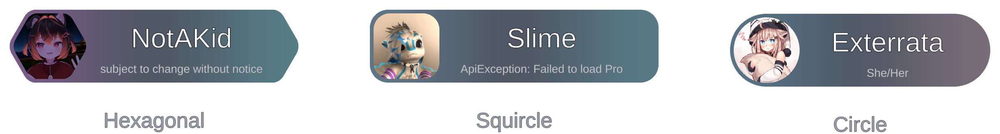
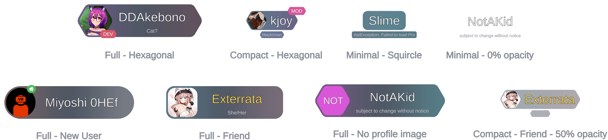
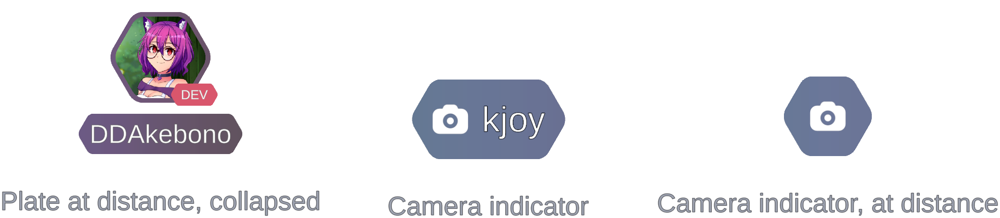
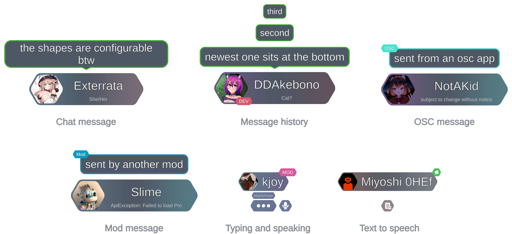

# CleanPlates

Replaces nameplates, chat bubbles, and camera indicator plates with cleaner ones.

### Features:
- Three plate styles: **Full**, **Compact**, **Minimal**
- Three plate shapes: **Hexagonal**, **Squircle**, **Circle**
- Adjustable scale and background opacity (can make plates transparent)
- Nameplates are personalized with a slight player color tint
- Chat bubbles sized to the message and tagged by source, with optional history bubbles
- New nameplate positioning logic to ensure plate is not obscured on avatars with big heads or when rotated by gravity

**Note:**

The mod respects the native **User Interface - Nameplate Customization** and **Audio & Comms - ChatBox** settings, but also
has its own preferences in UIExpansionKit. You may need to adjust some native ChatBox settings after installing the mod.

This mod also reimplements the UI part of ChatBox entirely, so some things may not behave identical to native.

### Shapes

### Styles

### Distance & Camera Indicators

### Chat

---

Here is the block of text where I tell you this mod is not affiliated with or endorsed by ChilloutVR.
https://docs.chilloutvr.net/official/legal/tos/#6-modding-our-game

> This mod is an independent creation not affiliated with, supported by, or approved by ChilloutVR. 

> Use of this mod is done so at the user's own risk and the creator cannot be held responsible for any issues arising from its use.

> To the best of my knowledge, I have adhered to the Modding Guidelines established by ChilloutVR.